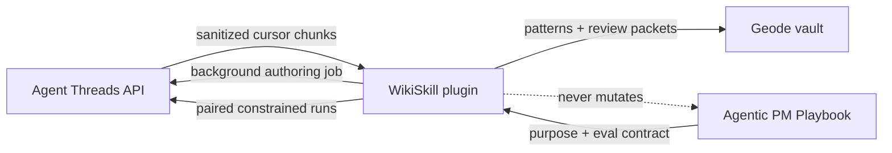

# Architecture

## Boundaries

- **Agent Threads** owns trace semantics, first-pass redaction, authoring threads, constrained execution, usage, cancellation, and durable idempotency.
- **WikiSkill** owns consent, eligibility, second-pass redaction, cursors, compilation, candidates, grading, scheduling, and review artifacts.
- **Agentic PM Playbook** owns canonical skills, purpose statements, fixtures, graders, invariants, and promotion through its normal PR workflow.
- **Geode** supplies the Obsidian-compatible plugin, vault, workspace, command, and settings APIs. No core change is required.

## Runtime states

The Threads adapter is a soft dependency. It registers lifecycle listeners before discovery, accepts only API major v1, captures a generation fence, and exposes `offline`, `read-only`, and `full` states. A generation change invalidates the cached provider immediately. Jobs use caller-owned IDs and one background thread per job.

## Data lifecycle

Plugin operational state is schema-versioned in `data.json`. Candidate drafts live only there and in explicit review packets, outside active skill roots. Knowledge is rendered under `Agent Knowledge/Skill Evolution/`, with pattern notes, an evolution log, impact history, and review packets.

Per-source cursor advancement happens only in the same persisted state update as sanitized evidence. Provider-owned revision and content hashes fence every source. Events without source-owned `invokedSkill` attribution are discarded. Candidate and evaluation records bind evidence, canonical skill, PURPOSE, contract, and fixture hashes and carry a terminal `promoted: false`.

Successful skill loading is not treated as task success. Invocation text is retained as an unknown-outcome observation, and only the provider-correlated terminal `skillRunOutcomes` record upgrades that invocation to success or failure. EOF continuation cursors are retained for same-revision appends. Source scanning is bounded by sources, bytes, and events, with a persisted source-page cursor preventing later sources from starving.

The plugin registers a bounded fifteen-minute interval because the Agent Threads cron surface cannot invoke another plugin's callback. Retention runs and persists before dependency and empty-queue checks. Work then shares a persisted UTC-day budget and per-skill lock with manual authoring/evaluation, skips an empty import, and runs the versioned Maintainer job.

## Contract isolation

`src/threads-contract.ts` pins the consumed subset of Agent Threads `api/public-api-v1.d.ts` (attribution/content-hash contract `c0b4bd1`) and `src/threads-adapter.ts` owns discovery/lifecycle behavior. Contract alignment does not leak provider implementation types through the compiler, evaluator, UI, or state models.
