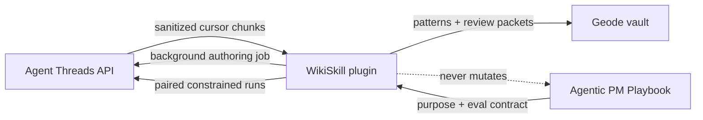

# Architecture

## Boundaries

- **Agent Threads** owns trace semantics, first-pass redaction, authoring threads, constrained execution, usage, cancellation, and durable idempotency.
- **WikiSkill** owns consent, eligibility, second-pass redaction, cursors, compilation, candidates, grading, scheduling, and review artifacts.
- **Agentic PM Playbook** owns canonical skills, purpose statements, fixtures, graders, invariants, and promotion through its normal PR workflow.
- **Geode** supplies the Obsidian-compatible plugin, vault, workspace, command, and settings APIs. No core change is required.

## Runtime states

The Threads adapter is a soft dependency. It registers lifecycle listeners before discovery, accepts only API major v1, captures a generation fence, and exposes `offline`, `read-only`, and `full` states. A generation change invalidates the cached provider immediately. Jobs use caller-owned IDs and one background thread per job.

## Data lifecycle

Plugin operational state is schema-versioned in `data.json`. Candidate drafts live only there and in explicit review packets, outside active skill roots. Knowledge is rendered under `Agent Knowledge/Skill Evolution/`, with pattern notes, an evolution log, impact history, and review packets.

Cursor advancement happens after eligibility filtering and sanitization. A source revision is retained for provenance. Candidate evaluation records carry a terminal `promoted: false`; promotion is deliberately absent from the plugin contract.

## Contract isolation

`src/threads-contract.ts` is the only provider wire contract and `src/threads-adapter.ts` owns discovery/lifecycle behavior. Contract alignment with Agent Threads does not leak provider implementation types through the compiler, evaluator, UI, or state models.
